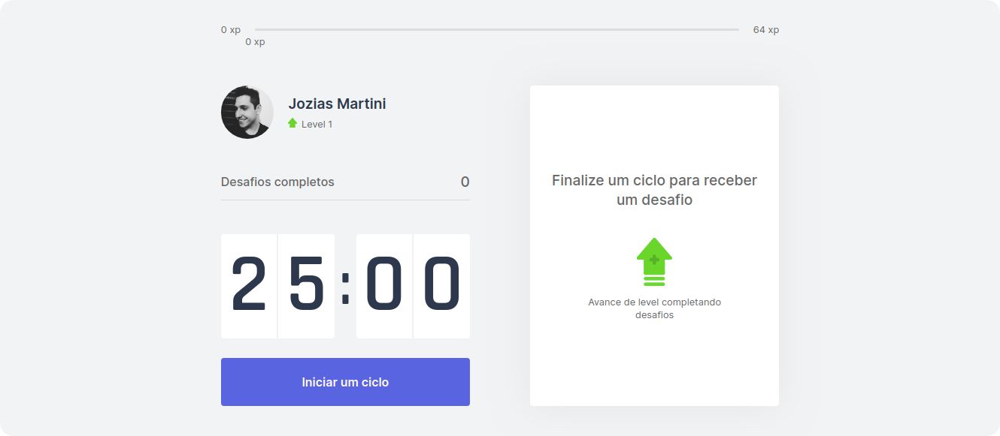

<h1 align="center">
    
</h1>

<p align="center">
  <a href="#project">Project</a>&nbsp;&nbsp;|&nbsp;&nbsp;
  <a href="#technologies">Technologies</a>&nbsp;&nbsp;|&nbsp;&nbsp;
  <a href="#preview">Preview</a>&nbsp;&nbsp;|&nbsp;&nbsp;
  <a href="#layout">Starting</a>&nbsp;&nbsp;|&nbsp;&nbsp;
  <a href="#layout">Layout</a>&nbsp;&nbsp;|&nbsp;&nbsp;
  <a href="#license">License</a>
</p>

<br>

## Project

This is a project developed during the Next Level Week (edition four) presented by Rocketseat.

## Technologies

This project was developed using the following technologies:

- [Next.js](https://nextjs.org/)
- [React](https://reactjs.org)
- [TypeScript](https://www.typescriptlang.org/)

## Preview

See the live project [deployed with Vercel](https://move-it-joziasmartini.vercel.app/).

## Starting

Clone the project and access the folder

```bash
$ git clone https://github.com/joziasmartini/nlw-four.git && cd nlw-four
```

Then, follow the steps below
```bash
# Install the dependencies
$ yarn

# Start the project
$ yarn dev
```

## Layout

You can view the project layout through [Figma](https://www.figma.com/file/ge20pu3ofMOKoliUyKx1Nl/Move.it-1.0).

## License

This project is licensed under the [MIT License](LICENSE.md).
